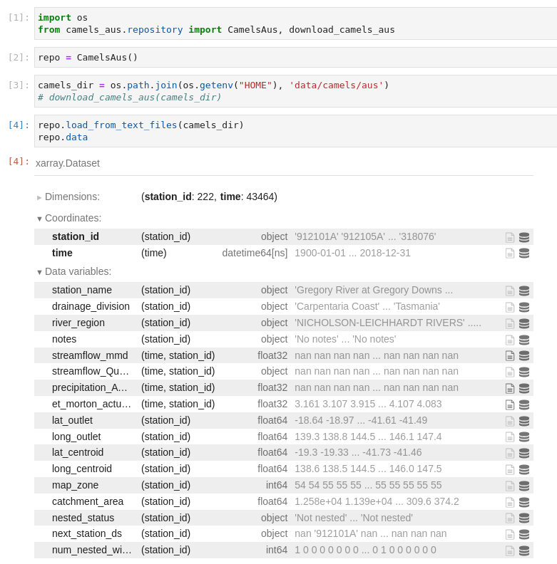

# CAMELS-AUS from python

[](https://github.com/csiro-hydroinformatics/camels-aus-py/blob/master/LICENSE)  

_This is currently a preview. You can contribute to features and design_

<!-- master: [](https://ci.appveyor.com/project/jmp75/camels-aus-py/branch/master) testing: [](https://ci.appveyor.com/project/jmp75/camels-aus-py/branch/testing) -->

**Python package to easily load and use the CAMELS-AUS dataset ([Fowler, K. J. A. et al. 2020 (in review)](https://doi.org/10.5194/essd-2020-228))**

CAMELS-AUS is the Australian edition of the Catchment Attributes and Meteorology for Large-sample Studies.



## License

BSD-3 (see [License](https://github.com/csiro-hydroinformatics/camels-aus-py/blob/master/LICENSE))

## Source code

The code repository is on [GitHub](https://github.com/csiro-hydroinformatics/camels-aus-py).

## Installation

### Linux

Using a conda environment is recommended. To create a new environment:

```bash
cd ${HOME}/tmp
wget https://raw.githubusercontent.com/csiro-hydroinformatics/camels-aus-py/main/configs/camels_aus_environment.yml
my_env_name=camels
onda env create -n $my_env_name -f ./camels_aus_environment.yml
conda activate $my_env_name 
```

Then:

```sh
pip install camels_aus
```

If installing from source, after checking out this git repo:

```sh
pip install -r requirements.txt # if not using conda
python setup.py install
```

Developers:

```sh
python setup.py develop
```

### optional: setting jupyter-lab

optional but recommended: use mamba as a replacement for conda: `conda install -c conda-forge --name ${my_env_name} mamba`

```sh
mamba install -c conda-forge jupyterlab ipywidgets jupyter ipyleaflet
python -m ipykernel install --user --name ${my_env_name} --display-name "CAMELS"
jupyter-lab .
```

## Troubleshooting

### Notebooks

Normally jupyter-lab version 3.0 and more does not require explicit extensions installation, but if you have issues:

if: "Loading widgets..."

```sh
jupyter-labextension install @jupyter-widgets/jupyterlab-manager
```

if: "Error displaying widget: model not found"

```sh
jupyter-labextension install @jupyter-widgets/jupyterlab-manager
```

